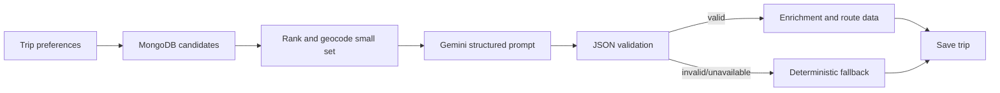

## Generation pipeline

### Candidate retrieval

POIs, hotels, and restaurants are filtered by destination and preferences
before any AI request. Results are capped. The restaurant collection is never
sent wholesale to an AI provider.

### AI responsibilities

Gemini produces packing guidance, weather interpretation, transport estimates,
recommendations, and itinerary reasoning. Weather text and transport data are
shown as AI guidance or estimates, never as live facts. The validator checks
the itinerary shape, day/date values, activity types, dataset references, and
coordinates.

### Fallbacks

- Gemini validation or availability failure: retry, then Hugging Face if
  configured, then deterministic itinerary/pre-trip/transport output.
- Google geocoding failure: Geoapify, then city-center fallback where safe.
- Google route failure: Geoapify road geometry, then client-side direct-line
  display only when no street route is available.
- Missing dataset coordinates: geocode only the small selected candidate set.
