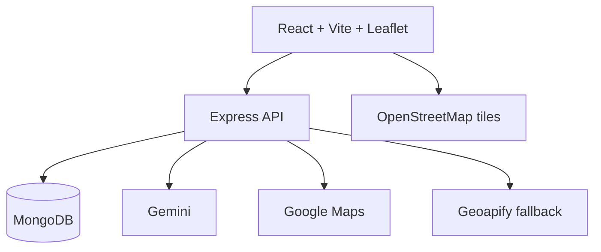

## Runtime boundaries

The browser renders maps with Leaflet and OpenStreetMap tiles. API keys and
provider calls remain on the server.

## Main flows

1. Authenticated users create a draft trip.
2. The generation service geocodes the destination and retrieves capped,
   ranked candidates from MongoDB.
3. Gemini receives structured candidates and trip context, and its JSON output
   is validated before persistence.
4. Invalid or unavailable AI output falls back to deterministic itinerary
   generation; Gemini calls can fall through to Hugging Face when configured.
5. Google route geometry is used first, with Geoapify routing as fallback.
6. Private trip reads and mutations enforce ownership. Public trips use the
   separate read-only public endpoint.

## Data ownership

- `scripts/` owns CSV ingestion and indexes.
- `server/src/services/recommendation/` owns candidate filtering and ranking.
- `server/src/services/itinerary/` owns clustering, sequencing, and fallback
  itinerary construction.
- `client/src/pages/` owns workflows; reusable UI lives under
  `client/src/components/`.
